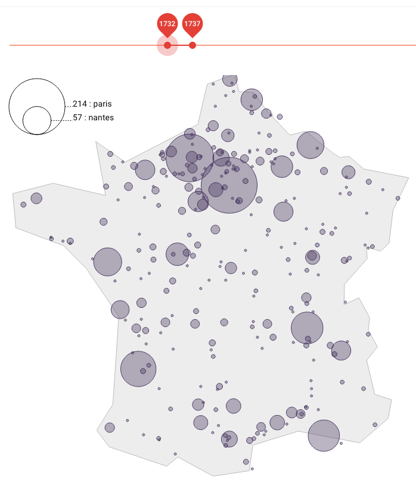

# Interface Bonnassieux

Interface de gestion des données numérisées issues conseil et bureau du commerce (1700-1791).
Projet de recherche interne de [Governance Analytics](https://www.governanceanalytics.org/).

https://fr.wikipedia.org/wiki/Conseil_et_bureau_du_commerce_(1700-1791)

Interface interactive utilisant : [Vue.js](https://vuejs.org/), [Vuetify](https://vuetifyjs.com/) et [D3.js](https://d3js.org/)

L'[API de ce projet ](https://github.com/chaves/bonnassieux_serveur) utilise [Laravel](https://laravel.com/).

